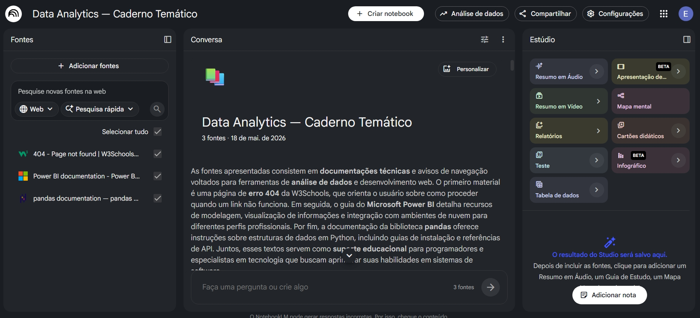
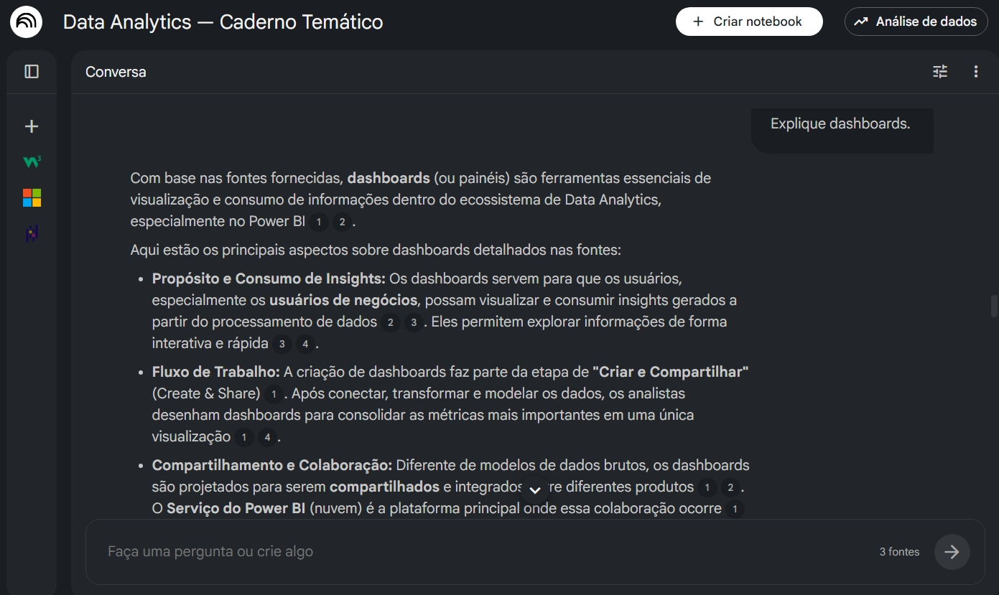
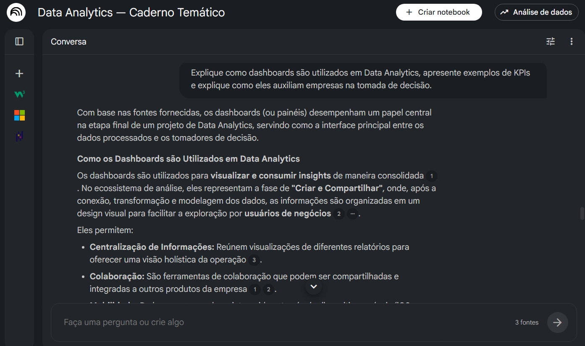
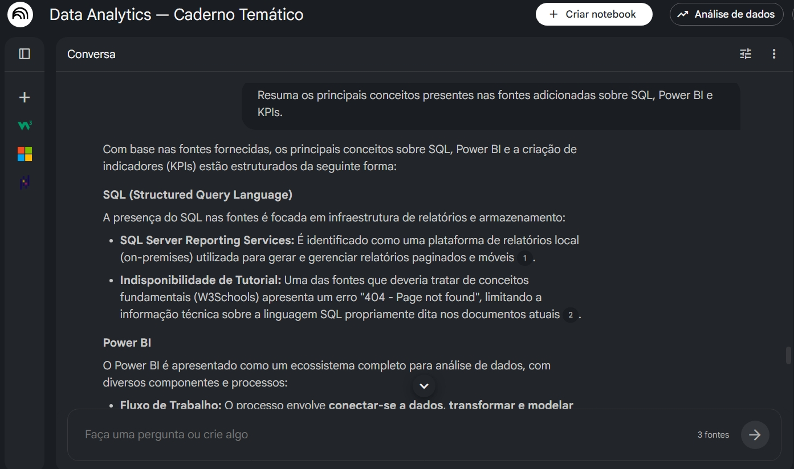

# 📊 Data Analytics com NotebookLM e Engenharia de Prompts


Projeto desenvolvido como desafio da DIO com foco na utilização de Inteligência Artificial aplicada aos estudos, curadoria de conteúdo e organização do conhecimento em Data Analytics.

# 📚 Sumário

- [🎯 Objetivos do Projeto](#-objetivos-do-projeto)
- [🛠️ Tecnologias e Ferramentas](#️-tecnologias-e-ferramentas)
- [📂 Estrutura do Repositório](#-estrutura-do-repositório)
- [📚 Curadoria de Fontes](#-curadoria-de-fontes)
- [🤖 Utilização do NotebookLM](#-utilização-do-notebooklm)
- [🧩 Engenharia de Prompts](#-engenharia-de-prompts)
- [📘 Miniguia de Estudos](#-miniguia-de-estudos)
- [📊 Casos Práticos](#-casos-práticos)
- [📈 Principais Aprendizados](#-principais-aprendizados)
- [🚀 Diferenciais do Projeto](#-diferenciais-do-projeto)
- [📌 Conclusão](#-conclusão)

# 🎯 Objetivos do Projeto

- Explorar o uso do NotebookLM na área de Data Analytics
- Desenvolver habilidades de curadoria de fontes
- Aplicar conceitos de engenharia de prompts
- Criar um mini guia de estudos sobre análise de dados
- Organizar documentação técnica de forma profissional
- Construir um repositório com padrão de portfólio para tecnologia

# 📂 Estrutura do Repositório

```bash
data-analytics-notebooklm/
│
├── docs/
│   ├── prompts/
│   ├── estudos/
│   ├── glossario/
│   ├── insights/
│   └── referencias/
│
├── notebooklm/
│
├── assets/
│
└── README.md
```

# 🛠️ Tecnologias e Ferramentas

Este projeto utilizou as seguintes ferramentas e tecnologias:

- NotebookLM
- GitHub
- Markdown
- SQL
- Python
- Power BI
- Pandas
- Excel
- Engenharia de Prompts
- Data Analytics

# 📚 Curadoria de Fontes

As fontes utilizadas foram selecionadas com foco em conteúdos confiáveis e relacionados à área de Data Analytics.

Algumas das principais referências utilizadas:

- Microsoft Learn — Power BI
- Documentação oficial do Pandas
- W3Schools SQL Tutorial
- Artigos sobre KPIs e métricas
- Conteúdos relacionados a Business Intelligence e análise de dados

As fontes foram adicionadas ao NotebookLM para apoio aos estudos, geração de resumos e testes de prompts.

# 🤖 Utilização do NotebookLM

O NotebookLM foi utilizado como ferramenta de apoio aos estudos e organização do conhecimento.

Durante o desenvolvimento do projeto foram realizados:
- testes de prompts
- refinamento de perguntas
- geração de resumos
- síntese de conteúdos
- análise de conceitos técnicos
- organização de insights

Os testes demonstraram que prompts mais específicos geram respostas:
- mais completas
- mais contextualizadas
- mais detalhadas

## 📸 NotebookLM em Utilização

### Notebook criado e organização das fontes



# 🧩 Engenharia de Prompts

Durante o projeto foram realizados testes práticos utilizando diferentes tipos de prompts no NotebookLM.

Os testes incluíram:
- prompts genéricos
- prompts refinados
- prompts focados em síntese
- prompts analíticos
- prompts direcionados para KPIs e dashboards

---

## 📌 Exemplos de Prompts Utilizados

### Prompt Genérico

```text
Explique dashboards.
```

Resultado:
- resposta clara
- conteúdo introdutório
- menor profundidade técnica

---

### Prompt Refinado

```text
Explique como dashboards são utilizados em Data Analytics, apresente exemplos de KPIs e explique como eles auxiliam empresas na tomada de decisão.
```

Resultado:
- resposta mais completa
- maior contextualização
- explicações mais detalhadas
- melhor relação com análise de dados

---

### Prompt de Síntese

```text
Resuma os principais conceitos presentes nas fontes adicionadas sobre SQL, Power BI e KPIs.
```
## 📸 Comparação de Prompts

### Prompt genérico



---

### Prompt refinado



---

### Diferença nas respostas geradas



Resultado:
- síntese objetiva
- organização clara
- facilidade para revisão de estudos

---

# 🧠 Principais Percepções

Os testes realizados demonstraram que:

- prompts específicos geram respostas mais completas
- contexto influencia diretamente a qualidade das respostas
- prompts objetivos facilitam síntese e revisão
- direcionamentos claros aumentam relevância técnica

Além disso, foi possível perceber a importância da engenharia de prompts para melhorar:
- organização das respostas
- profundidade dos conteúdos
- precisão das informações
- eficiência do aprendizado

# 📘 Miniguia de Estudos

O projeto também inclui um mini guia consolidado contendo:
- resumos estruturados
- glossário de conceitos
- prompts reutilizáveis
- aplicações práticas em Data Analytics

📂 Arquivo principal:

```bash
docs/miniguia/miniguia-data-analytics.md
```

O miniguia reúne os principais aprendizados obtidos durante os estudos utilizando o NotebookLM como ferramenta de apoio.

# 📊 Casos Práticos

Durante o desenvolvimento do projeto foram criados pequenos cenários simulando aplicações reais de Data Analytics.

O objetivo foi aplicar conceitos relacionados a:
- KPIs
- análise de indicadores
- interpretação de métricas
- geração de insights
- apoio da IA na análise de informações

---

## 📈 Caso Prático — Análise de Vendas

Neste cenário foi realizada uma análise simulada de vendas utilizando indicadores como:
- faturamento
- ticket médio
- crescimento mensal
- produtos mais vendidos

Além da interpretação dos dados, o NotebookLM foi utilizado para:
- organizar insights
- analisar indicadores
- gerar resumos
- apoiar interpretação estratégica

📂 Arquivo:

```bash
docs/casos-praticos/analise-vendas.md
```

# 📈 Principais Aprendizados

Durante o desenvolvimento deste projeto foi possível compreender:

- importância da curadoria de fontes confiáveis
- impacto da engenharia de prompts na qualidade das respostas
- potencial da IA como apoio aos estudos
- relevância da organização da documentação técnica
- aplicações práticas de Data Analytics no ambiente corporativo

Também foi possível perceber que prompts mais específicos geram:
- respostas mais completas
- maior profundidade técnica
- melhor contextualização
- sínteses mais organizadas

O projeto contribuiu para desenvolver:
- pensamento analítico
- organização de conhecimento
- documentação técnica
- visão inicial sobre Data Analytics

# 🚀 Diferenciais do Projeto

Este projeto foi estruturado com foco em:
- organização profissional
- documentação técnica
- aplicação prática de IA
- engenharia de prompts
- aprendizagem ativa

Além disso, o repositório busca demonstrar:
- raciocínio crítico
- pensamento analítico
- capacidade de síntese
- organização de estudos
- aplicação estratégica do NotebookLM

O projeto também foi desenvolvido considerando boas práticas de:
- documentação no GitHub
- estruturação de portfólio
- clareza visual
- organização de conteúdo técnico

# 📌 Conclusão

O desenvolvimento deste projeto permitiu explorar o uso da Inteligência Artificial aplicada aos estudos em Data Analytics utilizando o NotebookLM como ferramenta principal de apoio.

A experiência demonstrou a importância de:
- engenharia de prompts
- curadoria de fontes
- organização da informação
- análise crítica das respostas geradas pela IA

Além disso, o projeto contribuiu para consolidar conhecimentos relacionados a:
- SQL
- KPIs
- dashboards
- Power BI
- Python
- manipulação de dados

O repositório foi estruturado com foco em documentação técnica, organização profissional e construção de portfólio para a área de tecnologia e análise de dados.
